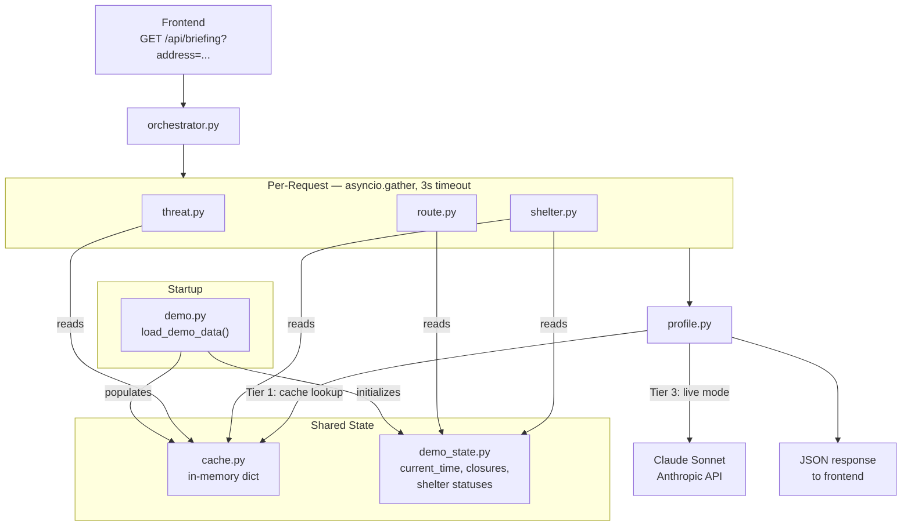

# Phase 3 — Backend Agents Implementation Plan

## Architecture Overview



---

## New Files to Create

- `backend/agents/__init__.py` — empty
- `backend/agents/threat.py` — Threat Agent
- `backend/agents/route.py` — Route Agent
- `backend/agents/shelter.py` — Shelter Agent
- `backend/agents/profile.py` — Profile Agent
- `backend/orchestrator.py` — asyncio.gather orchestration
- `backend/demo_state.py` — mutable demo scenario state
- `backend/scripts/generate_demo_briefings.py` — one-time script to pre-generate LLM briefings
- `data/scenarios/2023-west-kelowna/demo_route.json` — hardcoded routes + drive times + polyline
- `data/scenarios/2023-west-kelowna/demo_briefing.json` — pre-generated LLM briefings by flag key
- `data/scenarios/2023-west-kelowna/station_1277_weather.json` — cleaned station 1277 weather data

## Existing Files to Modify

- `backend/main.py` — wire `/api/briefing`, `/api/admin/situation`, mount StaticFiles
- `backend/demo.py` — implement `load_demo_data()` with cache + demo_state init

---

## Implementation Order

1. Data files (`station_1277_weather.json`, `demo_route.json`, `demo_briefing.json`)
2. `backend/demo_state.py`
3. Individual agents (threat, route, shelter, profile)
4. `backend/orchestrator.py`
5. `backend/demo.py` — `load_demo_data()`
6. `backend/main.py` — endpoints + StaticFiles mount
7. Test end-to-end with `DEMO_MODE=true`

---

## Key Design Decisions

### 1. Threat Agent — `backend/agents/threat.py`

**Distance calculation:** Use Shapely's `nearest_points()` between a `Point(lng, lat)` (user address) and the fire perimeter polygon. Reproject both to UTM Zone 11N (EPSG:32611) for metric distance — `.distance()` then returns meters. `pyproj` is already in `requirements.txt`.

**ISI to spread rate:** Simplified lookup based on the Canadian FWI system:

| ISI range | Rate of spread | Classification |
|---|---|---|
| < 5 | 0.5 km/h | LOW |
| 5–10 | 1.0 km/h | MODERATE |
| 10–20 | 2.0 km/h | HIGH |
| > 20 | 4.0 km/h | EXTREME |

Station 1277 at 7PM on Aug 17 had ISI ~24.4 → EXTREME / 4 km/h. Matches the real event.

**Time-to-perimeter:** `distance_km / spread_rate_kmh`. Simple division.

**Demo mode:** Load perimeter from cache (pre-loaded by `demo.py`), use weather from `station_1277_weather.json` at Aug 17 7PM. Hardcode demo address `1240 Marble Terrace` to `(49.8625, -119.5800)` — no geocoding API needed.

---

### 2. Route Agent — `backend/agents/route.py`

**Demo mode route:** Pre-computed in `data/scenarios/2023-west-kelowna/demo_route.json`:

- Primary: "Hwy 97 South via Boucherie Rd" — 5.8 km, 8 min, pre-encoded Google polyline string
- Fallback: "Hwy 97C West to Merritt" — 85 km, 55 min
- `shelter_drive_times` dict keyed by shelter ID (used by Shelter Agent)

The polyline is pre-encoded as a Google-format string directly in the JSON. No `polyline` package needed.

**Closure flagging:** Reads `active_closures` list from `demo_state` and looks up each closure's metadata from the `drivebc:closures` cache entry. Returns the closures list with road name + status. The primary southbound route avoids Westside Rd / Bear Creek — correct for the demo scenario.

**Live mode (future):** Call Google Maps Directions API. Not implemented in Phase 3.

---

### 3. Shelter Agent — `backend/agents/shelter.py`

**Ranking algorithm** — effective-drive-time scoring function, applied in this order:

1. **Load** shelter list from `shelters:all` cache + current statuses from `demo_state`
2. **Base drive times** from `directions:demo` cache (`shelter_drive_times` dict):
   - `shelter_001` Royal LePage: 8 min
   - `shelter_002` Kal Tire: 65 min
   - `shelter_003` Princess Margaret: 55 min
   - `shelter_004` Salvation Army: 15 min
   - `shelter_005` Prospera: 18 min
3. **Hard filter:** `profile.mobility == true` → remove any shelter where `is_accessible == false`
4. **Medical boost:** `profile.medical == true` and shelter `has_medical_power == true` → multiply drive time × 0.8
5. **Pet deprioritize:** `profile.pets == true` and shelter `has_pet_area == false` → add 30 min penalty
6. **Near-full penalty:** status `"Near Full"` → +10 min; `"Filling"` → +5 min
7. **Sort** by effective drive time ascending. Return top shelter as recommended + full ranked list.

---

### 4. Profile Agent — `backend/agents/profile.py`

**Three-tier briefing strategy:**

**Tier 1 — Pre-generated LLM (demo mode, primary):**
Look up briefing from `briefing:demo` cache by flag key. Keys: `"default"`, `"mobility"`, `"pets"`, `"medical"`, `"no_vehicle"`. These are real Claude Sonnet outputs, pre-generated once by `backend/scripts/generate_demo_briefings.py` and committed to `demo_briefing.json`.

**Tier 2 — Template fallback (demo mode, for un-cached flag combos):**
Compose a briefing from a base sentence + flag-specific addon sentences:

- Base: `"Fire is {distance_km} km from your address. At current wind speed ({wind_speed} km/h {wind_dir}), the projected boundary reaches your area in approximately {time_hours} hours. Evacuate via {route_summary} to {shelter_name} — {route_distance_km} km, about {route_duration_min} minutes."`
- Mobility addon: `"Recommended shelter has confirmed accessible entry."`
- Medical addon: `"This shelter has full electrical infrastructure for medical equipment."`
- Pets addon: `"Recommended shelter accepts pets."` (or `"Contact shelter staff about pet accommodation on arrival."` if no pet-friendly shelter)
- No vehicle addon: `"If you need transportation assistance, call Emergency Support Services at 1-800-387-4258."`

**Tier 3 — Live Anthropic API call:**
Full API call using the system prompt and structured JSON payload from CLAUDE.md. Used when `DEMO_MODE=false`.

The agent always assembles the structured JSON payload first (both modes). In demo mode it checks cache then falls back to the template. In live mode it calls the API.

**Pre-generation script:** `backend/scripts/generate_demo_briefings.py` — calls Claude Sonnet for ~5 flag variants, writes `demo_briefing.json`. Run once during development with a real `ANTHROPIC_API_KEY`. Commit the output.

---

### 5. Orchestrator — `backend/orchestrator.py`

**Flow:**

1. Receive `address` string + `profile` flags dict
2. Wrap each agent: `asyncio.wait_for(agent.run(...), timeout=3.0)`
3. `asyncio.gather(threat_coro, route_coro, shelter_coro, return_exceptions=True)`
4. Replace any `Exception` result with `None`
5. Pass all three results + profile to `profile.run()`
6. Profile agent checks for `None` and adjusts output gracefully

---

### 6. Demo State — `backend/demo_state.py`

Mutable module-level singleton. Phase 5 admin endpoints mutate it; all agents read from it.

```python
# Initial state at demo start (Aug 17, 7:00 PM — 2 closures active)
_state = {
    "current_time": "2023-08-17T19:00:00-07:00",
    "timeline_step": 1,
    "active_closures": ["closure_004", "closure_001"],
    "shelter_statuses": {
        "shelter_001": "Open",
        "shelter_002": "Open",
        "shelter_003": "Open",
        "shelter_004": "Open",
        "shelter_005": "Open",
    },
}
```

Functions to implement in Phase 3: `get_state()`, `set_shelter_status(id, status)`, `set_active_closures(ids)`, `reset()`.
Function to implement in Phase 5: `advance_time(hours)` (updates time, activates closures per demo_timeline, updates shelter statuses).

---

### 7. Demo Data Loading — `backend/demo.py`

`load_demo_data()` runs at startup when `DEMO_MODE=true`. Populates cache and demo_state:

| Cache key | Source file |
|---|---|
| `fire_perimeter:K52767` | `mcdougall_creek_perimeter.geojson` |
| `weather:1277` | `station_1277_weather.json` |
| `drivebc:closures` | `road_closures.json` |
| `shelters:all` | `shelters.json` |
| `directions:demo` | `demo_route.json` |
| `briefing:demo` | `demo_briefing.json` |
| `spread:2hr` | `spread_2hr.geojson` |
| `spread:4hr` | `spread_4hr.geojson` |
| `spread:6hr` | `spread_6hr.geojson` |

Also calls `demo_state.reset()` to set the 7PM starting state.

---

### 8. GET /api/briefing — `backend/main.py`

Query params: `?address=...&mobility=false&medical=false&pets=false&no_vehicle=false` (all default `false`).

In demo mode, address string is accepted but ignored — hardcoded coords `(49.8625, -119.5800)` are used. Response shape matches CLAUDE.md exactly. GeoJSON URLs point to `/static/` mount (e.g., `/static/mcdougall_creek_perimeter.geojson`).

---

### 9. Static File Serving — `backend/main.py`

Mount FastAPI `StaticFiles` on `/static` pointing to `data/scenarios/2023-west-kelowna/`. Required so the briefing response's `fire_perimeter_geojson` and `projections_geojson` URLs resolve correctly.

```python
from fastapi.staticfiles import StaticFiles
app.mount("/static", StaticFiles(directory="data/scenarios/2023-west-kelowna"), name="static")
```

---

### 10. GET /api/admin/situation — `backend/main.py`

Reads fire metadata + shelters from cache, active closures + shelter statuses from `demo_state`. Hardcoded evacuation counts: `under_order: 2462`, `under_alert: 4801`. Returns exact JSON shape from CLAUDE.md.
